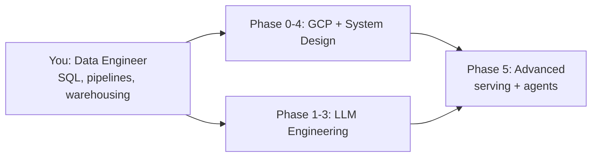

# AI / LLM / System Design / GCP - Learning Repository

Content-rich, **deduplicated** learning repo for a **Data Engineer (4 yrs)** moving into AI Engineering, System Design, and Google Cloud. Each topic file teaches the concepts directly with **Mermaid architecture diagrams** (rendered natively by GitHub).

## The Journey in One Diagram

## Repository Map

| Topic | What it covers | Level |
|---|---|---|
| [topics/01-system-design.md](topics/01-system-design.md) | Scalability, CAP, storage engines, caching, async, consistency patterns | Intermediate |
| [topics/02-ai-llm-fundamentals.md](topics/02-ai-llm-fundamentals.md) | Transformers, tokens, training phases, RLHF, eval, cost math | Foundation |
| [topics/03-llm-engineering.md](topics/03-llm-engineering.md) | RAG pipeline, chunking, hybrid search, reranking, LLMOps, deployment | Core |
| [topics/04-ai-agents-advanced.md](topics/04-ai-agents-advanced.md) | Agent loop, tool design, memory, orchestration patterns, guardrails, MCP/A2A | Advanced |
| [topics/05-llm-optimization.md](topics/05-llm-optimization.md) | Continuous batching, PagedAttention, quantization, speculative decoding | Advanced |
| [topics/06-cloud-data-engineering-advanced.md](topics/06-cloud-data-engineering-advanced.md) | Cloud compute/networking/IAM/cost, lakehouse, Iceberg, streaming, CDC, dbt | Advanced |
| [topics/07-gcp-data-engineering.md](topics/07-gcp-data-engineering.md) | BigQuery internals, BigLake + Iceberg, Dataflow, Composer vs Dataform, cert strategy | Advanced |
| [topics/08-gcp-cloud-engineering.md](topics/08-gcp-cloud-engineering.md) | GCP compute/storage/networking, IAM, Terraform, cost, cert path | Intermediate |

## Start Here

1. **Full plan:** [ROADMAP.md](ROADMAP.md) - 6 phases, weekly cadence, projects
2. **Projects:** [projects/README.md](projects/README.md) - hands-on milestones per phase
3. **First topic:** [topics/02-ai-llm-fundamentals.md](topics/02-ai-llm-fundamentals.md)

## Principles

1. **One resource, one home.** Each concept appears once.
2. **Learn -> Build -> Ship.** Every phase ends with a deployable project.
3. **Most leverage first.** Highest-impact techniques before micro-optimizations.
4. **Understand tradeoffs, not just names.** The skill is choosing between options under constraints.