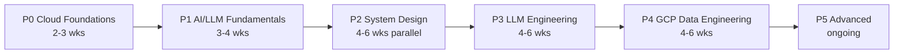

# Roadmap - 6 Phases

Order matters: foundation -> building -> advanced. Each phase is 2-4 weeks and ends with a deployable project.

## Phase 0 - Cloud Foundations (2-3 weeks)

Get hands-on with GCP before anything else. Free credits make this low-risk.

- Work through [topics/08-gcp-cloud-engineering.md](topics/08-gcp-cloud-engineering.md)
- Google Cloud Skills Boost Cloud Engineer path (free credits included)
- Take the **Associate Cloud Engineer** exam
- **Project:** batch pipeline Cloud Storage -> BigQuery via Cloud Composer

## Phase 1 - AI/LLM Fundamentals (3-4 weeks)

Understand how LLMs work so later decisions make sense.

- [topics/02-ai-llm-fundamentals.md](topics/02-ai-llm-fundamentals.md)
- DeepLearning.AI LLM Engineering for Everyone (free): https://www.deeplearning.ai/short-courses/llm-engineering-for-everyone/
- Optional math: Karpathy Zero to Hero: https://www.youtube.com/playlist?list=PLAqhIrjkxbuWI23v9cThsA9GvCAUhRvKZ
- **Project:** notebook calling an LLM API, structured JSON extraction, rate limits, cost logging

## Phase 2 - System Design (4-6 weeks, parallel)

Distributed systems reasoning. Your data background makes this fast.

- [topics/01-system-design.md](topics/01-system-design.md)
- Read Designing Data-Intensive Applications (Kleppmann)
- Whiteboard 10-12 classic designs out loud
- **Project:** redesign a real past pipeline at 10x scale; explain tradeoffs

## Phase 3 - LLM Engineering (4-6 weeks, highest priority)

Ship production LLM apps. This is the skill that gets hired.

- [topics/03-llm-engineering.md](topics/03-llm-engineering.md)
- DataTalksClub llm-zoomcamp (free): https://github.com/DataTalksClub/llm-zoomcamp
- Stack: LangChain -> pgvector -> Langfuse -> deploy with FastAPI
- **Project:** RAG app over your documents with eval + monitoring

## Phase 4 - GCP Data Engineering (4-6 weeks)

Professional Data Engineer cert. Your existing data skills become certified.

- [topics/07-gcp-data-engineering.md](topics/07-gcp-data-engineering.md)
- Official exam guide -> Coursera cert -> Skills Boost practice -> 2 timed mocks
- **Project:** streaming pipeline Pub/Sub -> Dataflow -> BigQuery with IAM + cost optimization

## Phase 5 - Advanced (ongoing)

Differentiate on the hard problems: serving efficiency and multi-agent systems.

- [topics/05-llm-optimization.md](topics/05-llm-optimization.md) - vLLM, quantization, speculative decoding
- [topics/04-ai-agents-advanced.md](topics/04-ai-agents-advanced.md) - LangGraph, memory, guardrails
- [topics/06-cloud-data-engineering-advanced.md](topics/06-cloud-data-engineering-advanced.md) - lakehouse, CDC, streaming patterns
- **Project:** serve an LLM with vLLM and measure optimization gains; build a supervisor/worker multi-agent system

## Principles

1. Consume less, build more
2. Practice out loud (system design especially)
3. Do mock exams/interviews - one struggle session > 10 hours of reading
4. Start simple - single-agent RAG beats a fragile multi-agent system 9 times out of 10