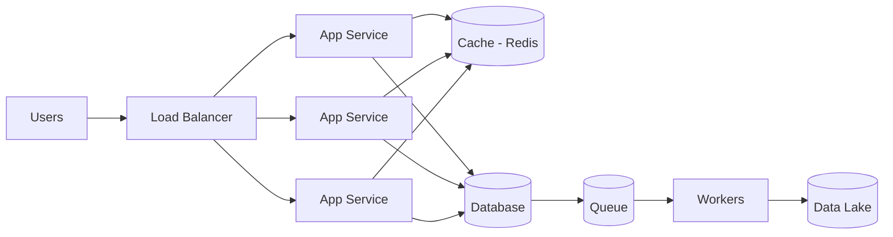
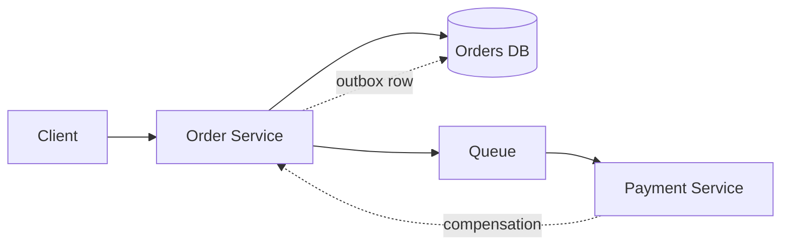

# System Design

Goal: reason about tradeoffs, not memorize diagrams. Every design question reduces to scale, consistency, cost, latency.

## Architecture in One Diagram

**Rule of thumb:** stateless app tier + cache in front + write-through to durable storage + queue for slow work.

## The 6 Questions That Decide Everything

1. **Read-heavy or write-heavy?**
   - Read-heavy -> cache, read replicas, CDN
   - Write-heavy -> append-only log, queue, batch writes

2. **Consistency or availability?**
   - Under a network partition you choose one (CAP). Document the business tradeoff.

3. **How much data, how fast does it grow?**
   - Scale number first, architecture second.

4. **Can it be async?**
   - If the user doesn't need the answer instantly, use a queue + worker.

5. **What if a node dies?**
   - Redundancy + failover + retries with idempotency.

6. **What is the budget?**
   - 99.9% = ~8.7h/yr downtime. SLAs cost money.

## Storage Engines (know the difference)

| Engine | Best at | Used by |
|---|---|---|
| B-tree | Point + range reads, in-place update | Postgres, MySQL |
| LSM-tree | Fast writes, high throughput | Bigtable, Cassandra, RocksDB |
| Append-only log | Sequential writes, replay | Kafka, WAL, event sourcing |

## Caching Patterns

| Pattern | How | Tradeoff |
|---|---|---|
| Cache-aside | Read cache, miss -> read DB, write cache | Simple, can be stale |
| Write-through | Write DB + cache together | Consistent, slower writes |
| Write-back | Write cache, flush async | Fast, data-loss risk |

**Hard part:** invalidation. Use TTLs, versioned keys, or event-driven invalidation (CDC).

## Async & Consistency Patterns

- **Outbox pattern:** write the event in the same DB transaction as the intent. A relay publishes it. Avoids the dual-write problem.
- **Saga:** sequence of local transactions + compensating actions on failure. Modern default for distributed transactions.
- **Idempotency:** retries must be safe. Add an idempotency key on write endpoints.

## Practice Set (10-12, explain out loud)

URL shortener, rate limiter, chat system, news feed, key-value store, web crawler, notification system, ride-sharing, video streaming, payment system, distributed ID generator, search.

## Go Deeper

- Book: Designing Data-Intensive Applications - https://www.oreilly.com/library/view/designing-data-intensive-applications/9781098119058/
- Book: System Design Interview Vol 1 - https://www.amazon.com/System-Design-Interview-Second-Insiders/dp/B08CMF2CQF
- Primer: https://github.com/donnemartin/system-design-primer
- Linear course: https://github.com/karanpratapsingh/system-design
- Videos: https://www.youtube.com/@ByteByteGo
- Practice list: https://github.com/ashishps1/awesome-system-design-resources