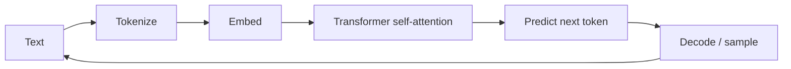
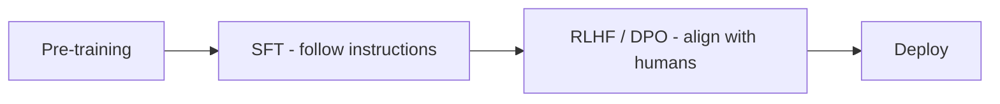
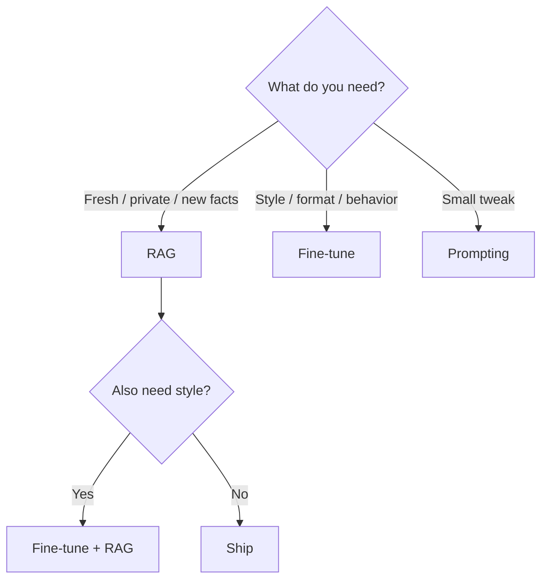

# AI / LLM Fundamentals

The mental model you need before building anything. ~1-2 weeks.

## How an LLM Produces Text

- **Tokens:** text is split into subword units (~4 chars). Every cost and latency number is token-based.
- **Embeddings:** meaning as vectors. Similar meaning = nearby vectors. This powers search/RAG.
- **Self-attention:** each token "looks at" every other token. O(n^2) cost -> long context is expensive.
- **Decode:** pick the next token from a probability distribution (temperature, top-p).

## Training Phases

- **Pre-training:** predict next token on trillions of tokens. Expensive. Produces a base model with "world knowledge."
- **SFT:** instruction/response pairs -> learns to follow instructions.
- **RLHF/DPO:** human preference ranking -> alignment. DPO is the cheap alternative used in 2025+.

**You never pre-train.** Use prompting -> RAG -> fine-tuning, in that order. RAG for facts/freshness, fine-tuning for style/format/domain behavior.

## Key Concepts

- **Context window:** max in + out tokens. Long windows exist but quality degrades with distance.
- **Hallucination:** fluent but false. Can't eliminate; bound it with RAG, citations, low temperature for facts.
- **Structured output:** force JSON via constrained decoding / function calling. Learn Instructor.
- **Eval:** golden dataset + metrics before AND after every change. Without evals you're guessing.
- **Cost math:** cost = in_tokens x in_price + out_tokens x out_price (out is ~3-4x). Latency = prefill + decode.

## Decision Flow

## Go Deeper

- Course: DeepLearning.AI LLM Engineering for Everyone - https://www.deeplearning.ai/short-courses/llm-engineering-for-everyone/
- Course: Generative AI with LLMs - https://www.coursera.org/learn/generative-ai-with-llms
- Build one: https://github.com/rasbt/LLMs-from-scratch
- Roadmap: https://github.com/mlabonne/llm-course
- Prompts: https://github.com/dair-ai/Prompt-Engineering-Guide