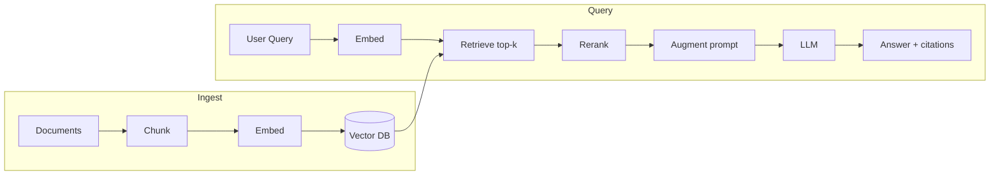
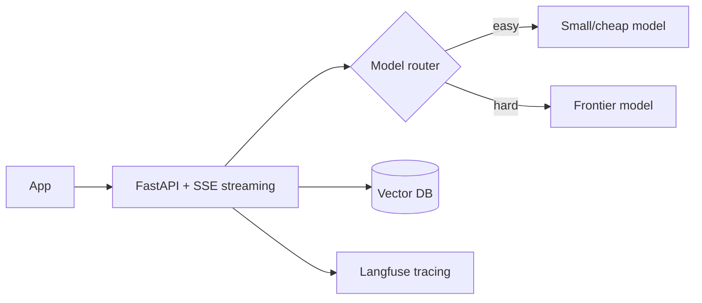

# LLM Engineering - RAG, Apps, LLMOps

The core skill: turn an LLM into a reliable product. Your data background is a superpower here.

## RAG Pipeline in One Diagram

## The Parts and How to Get Each Right

| Step | Pitfall | Fix |
|---|---|---|
| Chunking | Fixed char counts cut meaning | Semantic boundaries, 10-20% overlap, keep structure (headers/tables) |
| Embeddings | Old vectors after chunking change | Re-embed on any change; embed what will be *searched* |
| Vector DB | Pure vector misses typos/IDs | Hybrid: vector + BM25 via reciprocal rank fusion |
| Retrieval | Top-3 raw cosine is noisy | Retrieve top-30, rerank to top-3/5 with a cross-encoder |
| Prompt | Model ignores context | "Answer ONLY from context. Cite. If absent, say so." |
| Eval | No baseline | RAGAS + golden set before/after every change |

**Vector DB choice:** start with pgvector (Postgres, you know SQL). Scale-up: Qdrant, Milvus.

## When RAG vs Fine-tuning vs Prompting

| Need | Use |
|---|---|
| New/fresh/private facts | RAG |
| Style/format/domain behavior | Fine-tuning |
| Quick small tweak | Prompting |
| Both facts AND style | RAG + fine-tune |

RAG first, always.

## Production Layer (LLMOps)

- **Observability:** trace every call (input, output, tokens, cost, retrieved chunks). Langfuse.
- **Evaluation:** golden dataset + RAGAS. Run on every prompt/chunking/model change.
- **Cost control:** log tokens per request, route easy queries to cheap models, cache repeats.
- **Guardrails:** input/output filters (PII, prompt injection). NeMo Guardrails, Llama Guard.
- **Structured output:** Instructor for typed extraction.

## Deployment Stack

- Start with hosted APIs (OpenAI/Anthropic/Gemini). Self-host with vLLM when cost/control matters.
- LangChain for chains/tools, LangGraph for stateful flows.
- No-code fast path: Dify.

## Your Data-Engineer Advantage

- Pipelines -> ingest/embed pipelines (Dataflow/Airflow/dbt)
- Warehouse -> BigQuery/Postgres as structured context source
- CDC -> keep vector store fresh when source data changes
- Data quality -> eval + guardrails IS data quality for LLM apps

## Go Deeper

- Bootcamp: https://github.com/DataTalksClub/llm-zoomcamp
- Book+code: https://github.com/HandsOnLLM/Hands-On-Large-Language-Models
- LangChain: https://github.com/langchain-ai/langchain
- LlamaIndex: https://github.com/run-llama/llama_index
- Langfuse: https://github.com/langfuse/langfuse
- RAGAS: https://github.com/explodinggradients/ragas
- Examples: https://github.com/Shubhamsaboo/awesome-llm-apps