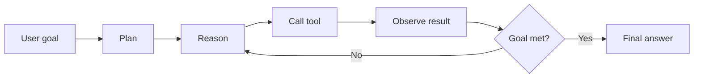
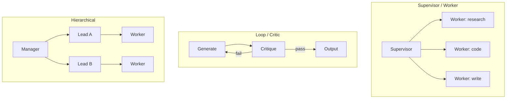
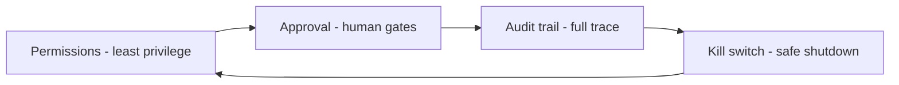

# Advanced AI Agents

The hardest and most in-demand area in 2026. Most agent projects fail on **coordination**, not model quality.

## The Agent Loop

An agent = an LLM in a loop that reasons, acts (tools), observes, and repeats. Agency = side effects.

## Core Components

- **Model:** often smaller specialized models per task (routing > one giant model)
- **Tools:** APIs, DB queries, code exec. **Tool design drives reliability more than model choice.**
- **Memory:** working (context) / short-term (session) / long-term (vector + graph). Mem0, Letta, pgvector.
- **Planning:** break goal into steps; re-plan on failure (ReAct).
- **Structured output:** every tool call must parse reliably (function calling / constrained decoding).

## Orchestration Patterns (2026 taxonomy)

1. **Sequential** - linear steps. Simple.
2. **Parallel** - fan out independent work. Speed, watch cost.
3. **Loop / Critic** - generate, critique, regenerate. Biggest quality jump.
4. **Supervisor / Worker** - orchestrator routes to specialists. Production favorite.
5. **Hierarchical** - manager -> leads -> workers. Complex long-running tasks.
6. **Peer-to-peer** - agents collaborate directly (A2A).
7. **Marketplace** - dynamic discovery of agents by capability.
8. **Human-in/on-the-loop** - approve each action (in) vs monitor + intervene (on). On = 2026 trend.

## Framework Choice

| Framework | Best for |
|---|---|
| LangGraph | Complex stateful workflows, checkpointing. Production standard. |
| CrewAI | Simple role teams, fastest prototype |
| AutoGen | Agent deliberation, human-in-the-loop |
| OpenAI Agents SDK | Handoffs + guardrails as primitives |
| MetaGPT | Software-company simulation |

**Decision rule:** performance + cost sensitive -> LangGraph. Deliberation -> AutoGen. Minimal -> Agents SDK.

## Interoperability

- **MCP** (Model Context Protocol): agent <-> tools standard. https://github.com/modelcontextprotocol/servers
- **A2A** (Agent2Agent): agent <-> agent standard. https://github.com/google/A2A

## Reliability Essentials

- **Checkpointing** - persist graph state; crash resumes, not restarts
- **Durable execution** - Temporal-style retries, sagas for long workflows
- **Failure handling** - circuit breakers, retries + backoff, validate every tool result
- **Non-determinism compounds** - validate types at handoffs

## Guardrails (the #1 enterprise gap)

81% of agents are in operation, ~14% fully approved. Design guardrails in, not after.

## Failure Modes to Learn

- Stuck in loops -> step limits + timeouts
- Tool misuse -> strict schemas + validation + approval for destructive ops
- Hallucination amplified across hops -> grounding + citation + eval
- Cost explosion -> budgets per agent, routing, caching
- Prompt injection through tools -> sanitize inputs, least-privilege tools, sandboxing

## Go Deeper

- Patterns w/ code: https://github.com/balakumardev/ai-agent-design-patterns
- Azure orchestration patterns: https://learn.microsoft.com/en-us/azure/architecture/ai-ml/guide/ai-agent-design-patterns
- Research tracker: https://github.com/masamasa59/ai-agent-papers
- Survey: https://arxiv.org/abs/2510.25445
- Cloud-native: https://github.com/panaversity/learn-agentic-ai