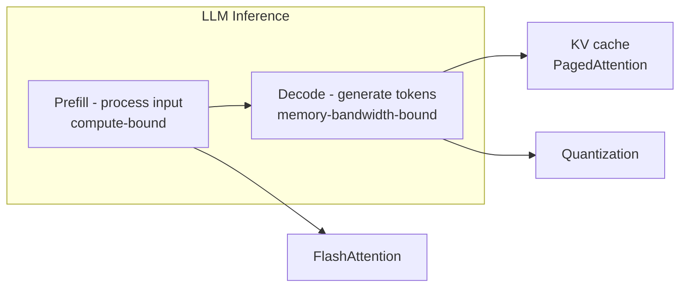
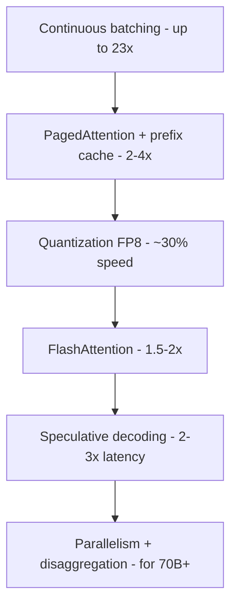
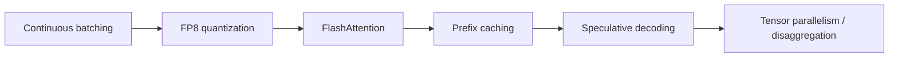

# LLM Optimization - Serving, Inference, Cost

The levers for throughput, latency, and cost at scale. Only after you can build working LLM apps.

## Where the Time Goes

Two different bottlenecks:
- **Prefill:** compute-bound -> FlashAttention, better kernels
- **Decode:** memory-bandwidth-bound -> KV cache, quantization

## Techniques Ranked by Impact

| Technique | Gain | When |
|---|---|---|
| Continuous batching | up to 23x | Always (free with vLLM) |
| PagedAttention | 2-4x | Always; KV cache memory |
| Prefix caching | 2x+ | Long shared system prompts (RAG/agents) |
| Quantization | ~30% speed, 3-4x memory | FP8 default; INT4 only if memory-bound |
| FlashAttention | 1.5-2x | Default on in modern engines |
| Speculative decoding | 2-3x latency | Predictable text (code, JSON). Measure acceptance. |
| Tensor/pipeline parallelism | scale | 70B+ models |

## Quantization Reference

| Method | Bits | Notes |
|---|---|---|
| FP8 | 8 | Gold standard; near-lossless on Hopper/Blackwell |
| AWQ / GPTQ | 4 | 3-4x memory cut, model-aware |
| GGUF | 4-8 | llama.cpp / CPU / edge |

Start FP8. Drop to INT4 only when memory-constrained.

## Which Engine

| Engine | When |
|---|---|
| vLLM | Default. Easy, big community, all features. |
| SGLang | Highest throughput for agent/RAG workloads |
| TensorRT-LLM | Peak NVIDIA perf; best TTFT |
| llama.cpp | CPU / edge / local |
| Megatron-LM | Parallelism for huge models |

## Production Recipe

## Metrics to Monitor

- **TTFT** (time to first token) - UX
- **Throughput** (tokens/s) - cost
- **P99 latency**, KV cache utilization, GPU memory
- Spec-decoding acceptance rate (<60% = not working)

## Go Deeper

- NVIDIA canonical guide: https://developer.nvidia.com/blog/mastering-llm-techniques-inference-optimization/
- Red Hat distributed inference: https://developers.redhat.com/articles/2026/06/24/optimizing-distributed-ai-inference-advanced-deployment-patterns
- Impact rankings: https://zylos.ai/research/2026-01-15-llm-inference-optimization/
- Deep guide: https://www.youngju.dev/blog/llm/2026-03-14-llm-inference-optimization-vllm-tensorrt-speculative-decoding.en
- Blueprints: https://github.com/ludwig-ai/llm-inference-solution-architectures
- vLLM: https://github.com/vllm-project/vllm