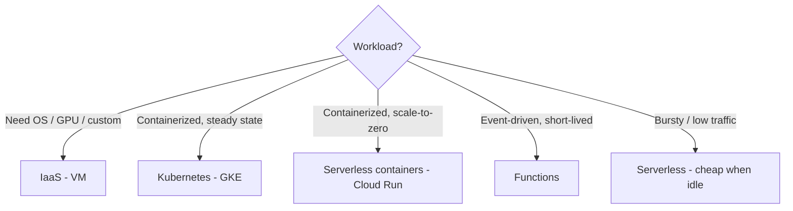
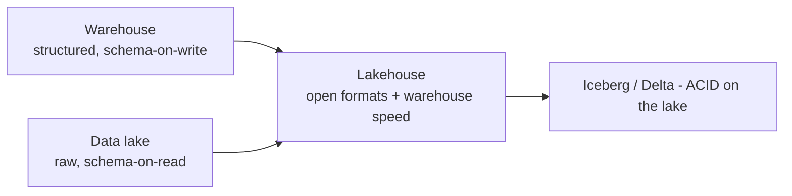
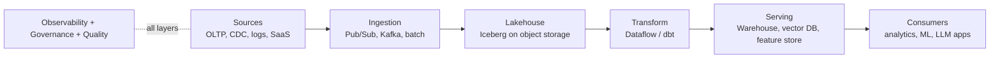

# Advanced Cloud & Data Engineering

Cloud-agnostic fundamentals + modern data architecture. The layer beneath both GCP certs and AI engineering.

## Part A - Cloud Computing

### Compute Models (choose by workload)



Tradeoff: control vs ops burden vs cost. Serverless for bursty/low traffic; containers for steady; VMs for full control.

### Storage Hierarchy

```
Object storage (GCS/S3) = data lake, backup
File (Filestore/EFS) = shared file systems
Block (Persistent Disk/EBS) = VMs
Relational = transactional truth
NoSQL = hot app data
```

### Networking Essentials

VPC + subnets + firewalls (default-deny + explicit allows) + Cloud NAT + DNS.
Load balancing: global L7 (HTTP, URL routing) vs regional L4 (TCP/UDP) vs internal.
**Exam logic:** "private instance, no public IP, reachable from on-prem" -> VPC peering / VPN / Private Service Connect.

### IAM & Security (the 4 As)

- **Authentication** - who
- **Authorization** - least privilege, service accounts, scoped roles
- **Audit** - logs everywhere
- **Asset protection** - secrets in Secret Manager, KMS encryption, no hardcoded keys

### Cost Management

- On-demand vs committed use vs spot
- Right-size + autoscale + storage lifecycle (hot -> cold -> archive)
- Tags + budgets + alerts. **Idle resources are the #1 waste.**

### Reliability

- SLI (actual) -> SLO (target) -> SLA (contract). "99.9%" is a budget.
- Design for failure: multi-AZ/region, retries + backoff, idempotency, graceful degradation.
- IaC: Terraform for everything. Environments = code, reviewable.

## Part B - Data Engineering

### Architecture Evolution



**The 2026 default:** lakehouse with **Apache Iceberg** - ACID, time travel, schema evolution, multi-engine access, on object storage.

**ELT over ETL:** load raw first, transform in-warehouse (dbt/Dataform).

### Batch vs Streaming

| Dimension | Batch | Streaming |
|---|---|---|
| Freshness | Daily/hourly | Seconds-minutes |
| Cost | Cheap | More expensive |
| Reprocessing | Easy | Hard |
| When | 90% of pipelines | Dashboards, alerts, fraud, event-driven |

**Kappa over Lambda** (one streaming path, replay = reprocess). Micro-batch for simplicity.

### Streaming Fundamentals (the hard 20%)

- **Windowing:** tumbling (fixed), sliding, session
- **Watermarks + late data** - the hard part
- **Exactly-once** is usually at-least-once + idempotency/dedup
- **CDC** (Change Data Capture): Debezium/connectors keep the lake fresh from OLTP

### Orchestration vs Transformation

- **Orchestrate:** Airflow/Composer - dependencies, retries, scheduling
- **Transform:** dbt (SQL, versioned, tested, in-warehouse) / Dataflow / Spark
- Orchestrator coordinates, pipelines transform.

### Data Quality & Governance

- Tests at every stage: freshness, volume, schema (dbt tests, Great Expectations)
- Catalog, lineage, data contracts (schema + semantics + SLA), PII masking, retention
- **Data contracts = the API for data**

### The 2026 Data Platform (memorize this shape)



## Go Deeper

- Book: DDIA - https://www.oreilly.com/library/view/designing-data-intensive-applications/9781098119058/
- dbt: https://github.com/dbt-labs/dbt-core
- Great Expectations: https://github.com/great-expectations/great_expectations
- Debezium (CDC): https://github.com/debezium/debezium
- Airflow: https://github.com/apache/airflow
- Iceberg: https://github.com/apache/iceberg
- Terraform: https://github.com/hashicorp/terraform