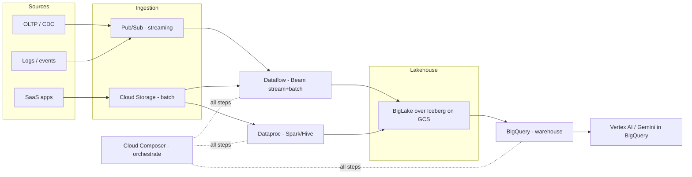
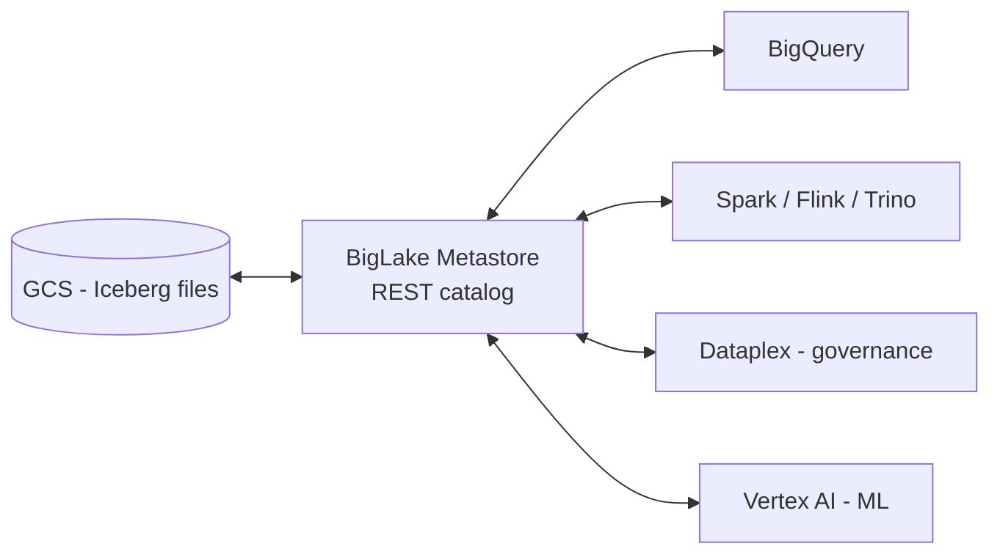
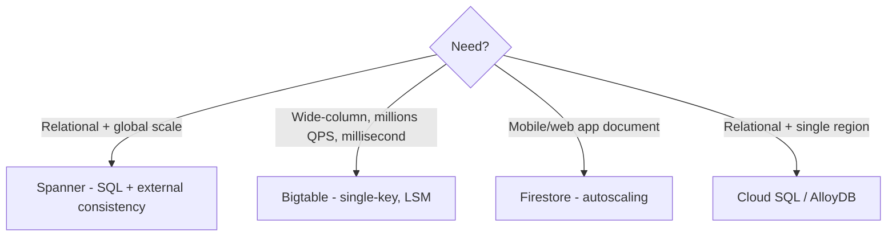

# GCP Data Engineering (Professional Data Engineer)

The exam is **scenario-based**: it tests *which service under which constraint*. Learn the platform shape, then the tradeoffs.

## The GCP Data Platform in One Diagram

## BigQuery - the center of gravity

- Serverless petabyte warehouse. Columnar, separate compute/storage, **slots** for concurrency.
- **Partitioning** (by date, prunes bytes = cost) vs **clustering** (co-locates similar values, faster). Partition for cost, cluster for speed.
- **Slots:** on-demand (pay per query) vs capacity (reserved + autoscaling). Cost questions always involve this.
- **Storage lifecycle:** active -> long-term (90-day discount) -> Iceberg managed tables / BigLake external.
- **Real-time:** Storage Write API (gRPC). The modern ingest path.
- **BigQuery ML / Gemini in BigQuery:** train models + run LLM analytics in SQL. Your differentiator.

## BigLake + Iceberg = the GCP lakehouse

**Why it matters:** ACID, schema evolution, time travel, auto-clustering, streaming via Storage Write API, column-level security, multi-engine access - all open format. **This is the modern lakehouse on GCP. Know this architecture.**

## Dataflow (Apache Beam)

- Same code for batch + stream. Runner v2, Streaming Engine, Shuffle Service.
- **Streaming concepts tested:** windows (tumbling/sliding/session), watermarks, late data, side inputs.
- **SDK skills:** ParDo, GroupByKey/Combine, state/timers, I/O connectors (Pub/Sub, Kafka, BigQuery, GCS, Iceberg).

## Composer vs Dataform

| | Cloud Composer (Airflow) | Dataform |
|---|---|---|
| What | Orchestrate external steps | SQL ELT in BigQuery |
| Use for | Cross-service workflows | In-warehouse transforms |
| Model | Python DAGs, retries, SLAs | Versioned, tested SQL, environments |

## The Classic Tradeoff Questions

### Dataflow vs Dataproc
| Dimension | Dataflow | Dataproc |
|---|---|---|
| Model | Beam, serverless | Spark/Hadoop, cluster |
| Ops | None to manage | You manage |
| Cost | Pay per work | Pay for cluster time |
| Best for | Streaming, greenfield, portability | Existing Spark skills, ML pre-processing |

### Bigtable vs Firestore vs Spanner

## Security & Governance (exam-heavy)

- **IAM least privilege**, service accounts, workload identity
- **Column-level security + data masking + DLP** for PII
- **Dataplex:** catalog, lineage, quality, policies
- **VPC-SC** (exfiltration control), CMEK/CSEK encryption

## Exam Strategy

1. Read the official exam guide: https://cloud.google.com/learn/certification/data-engineer
2. Coursera cert: https://www.coursera.org/professional-certificates/gcp-data-engineering
3. Skills Boost practice + labs: https://www.cloudskillsboost.google/paths/16 (the #1 thing people skip)
4. 2+ timed mock exams. Practice *eliminating* wrong options: "this fails on cost/latency/consistency."
5. Get hands-on - courses alone won't pass it.

## Your Differentiators

- **Iceberg + BigLake** - build the lakehouse
- **Gemini in BigQuery** - LLM + warehouse in one demo
- **Correct windowing/watermarks** - show you know the hard 20%

## Go Deeper

- BigQuery docs: https://cloud.google.com/bigquery/docs
- Iceberg in BigQuery: https://cloud.google.com/bigquery/docs/biglake-iceberg-tables-in-bigquery
- Dataflow templates: https://github.com/GoogleCloudPlatform/dataflow-templates
- Professional services: https://github.com/GoogleCloudPlatform/professional-services
- DataCamp track: https://www.datacamp.com/tracks/google-cloud-data-engineer