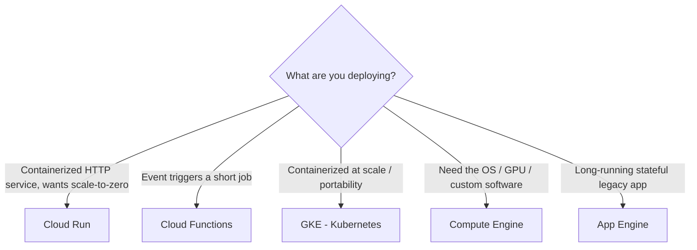
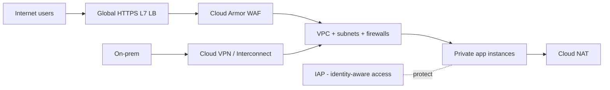

# GCP Cloud Engineering (Associate -> Professional Architect)

Entry-level cloud engineering, then advanced architecture. Do this before the Data Engineer cert if GCP is new to you.

## Compute - Pick the Right Primitive

**Exam logic:** "HTTP service, containerized, scale-to-zero" -> Cloud Run. "GCS event triggers job" -> Cloud Functions.

## Storage Decisions

- **Cloud Storage:** classes Standard -> Nearline -> Coldline -> Archive. **Lifecycle rules** auto-transition (cost questions love this).
- **Persistent Disk:** block storage for VMs.
- **Filestore:** shared NFS.
- **Cloud SQL:** managed Postgres/MySQL, single region.
- **Spanner:** globally distributed relational.
- **AlloyDB:** Postgres-compatible, transactional + analytical.

## Networking (memorize the primitives)

- VPC, subnets, firewall rules (default-deny + explicit allows), Cloud NAT, DNS.
- L7 global vs L4 regional vs internal load balancing.

## IAM & Security

- Roles: primitive < predefined < custom (least privilege)
- **Service accounts** + workload identity; short-lived creds; no hardcoded keys
- Org policies, VPC Service Controls, KMS/CMEK, Secret Manager
- Cloud Audit Logs + Logging/Monitoring

## IaC & CI/CD (modern expectation)

- **Terraform** for all infrastructure (state, modules, review)
- **Cloud Build** CI/CD; **Cloud Deploy** progressive delivery (canary/rollback)
- GitOps on GKE (Config Sync / Argo CD)

## Cost Management

- Committed Use Discounts (steady VMs), spot (fault-tolerant batch), autoscaling
- GCS lifecycle to cold classes; BigQuery slot reservations
- Budgets + alerts + billing export to BigQuery (your data skills help here)

## Path to Professional Cloud Architect (optional)

Advanced: HA architectures, security design, cost/perf optimization, migration planning, ML on GCP (Vertex AI). Combine with [06-cloud-data-engineering-advanced.md](06-cloud-data-engineering-advanced.md) and [01-system-design.md](01-system-design.md).

## Exam Strategy (hands-on heavy)

1. Skills Boost Cloud Engineer path: https://www.cloudskillsboost.google/paths/9 (free credits)
2. Coursera prep: https://www.coursera.org/learn/preparing-cloud-associate-cloud-engineer-certification-exam
3. **Do the labs** - courses alone won't pass it
4. Mock exams (Whizlabs, ExamPro)

Exam asks *"choose the resource under a constraint"* -> practice decision tables, not recall.

## Your Differentiators

- **Billing cost analytics:** build a billing BigQuery dataset + Looker dashboard
- **IaC for the data stack:** Terraform-provision the GCP data platform from [07-gcp-data-engineering.md](07-gcp-data-engineering.md)

## Go Deeper

- Cert pages: https://cloud.google.com/learn/certification/cloud-engineer and https://cloud.google.com/learn/certification/cloud-architect
- Architecture center: https://cloud.google.com/architecture
- Labs: https://www.cloudskillsboost.google/catalog
- Terraform provider: https://github.com/hashicorp/terraform-provider-google